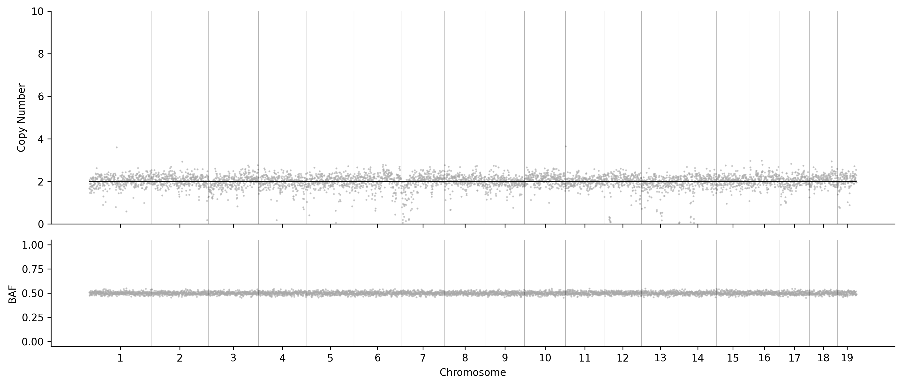

## Running HiScanner with Demo Data

<details>
<summary>1. Download and Extract Demo Data</summary>

```bash
# Download from Figshare
# Go to https://figshare.com/s/c5aeb5bc039a2990fc89
# Click "Download all (468.29Mb)"

# Extrac the downloaded files
unzip 28369088.zip
tar -xvf scan2_out.tar.gz

# Clean up
rm 28369088.zip scan2_out.tar.gz
```
</details>

<details>
<summary>2. Initialize Project</summary>

```bash
# Activate environment
conda activate hiscanner_test

# Initialize (choose one)
hiscanner init # then edit config.yaml
# OR use the provided config.yaml
cp resources/config.yaml .
# remember to edit the config.yaml file to set the correct paths
```
</details>

<details>
<summary>3. Validate Setup</summary>

```bash
hiscanner validate
```

Expected output:
```
INFO     ✓ Configuration validated successfully
INFO     ✓ Output directories can be created
WARNING  Missing Raw variants VCF MD5: scan2_out/gatk/hc_raw.mmq60.vcf.gz.md5
WARNING  Missing Phased hets VCF MD5: scan2_out/shapeit/phased_hets.vcf.gz.md5
INFO     ✓ SCAN2 outputs validated successfully
INFO     ✓ bcftools validated successfully
INFO     ✓ samtools validated successfully
INFO     ✓ R and mgcv package validated successfully
INFO     All validation checks passed successfully!
```
</details>

<details>
<summary>4. Run Pipeline Steps</summary>

### Step 1: SNP Calling
```bash
hiscanner run --step snp
```
Expected output:
```
INFO     Running snp step...
INFO     Preparing SNP calling results
WARNING  Missing Raw variants VCF MD5: scan2_out/gatk/hc_raw.mmq60.vcf.gz.md5
WARNING  Missing Phased hets VCF MD5: scan2_out/shapeit/phased_hets.vcf.gz.md5
INFO     SNP calling results prepared successfully
INFO     ✓ Pipeline completed successfully
```

### Step 2: Phasing
```bash
hiscanner run --step phase
```
Expected output:
```
INFO     Running phase step...
INFO     Starting phasing step
WARNING  Missing Raw variants VCF MD5: scan2_out/gatk/hc_raw.mmq60.vcf.gz.md5
WARNING  Missing Phased hets VCF MD5: scan2_out/shapeit/phased_hets.vcf.gz.md5
INFO     Processing 3 cells
INFO     Running bcftools query for SRR6204923_Lymphocyte-068
INFO     Running bcftools query for SRR6204878_Lymphocyte-015
INFO     Running bcftools query for SRR6204925_Lymphocyte-066
[... Processing details ...]
INFO     Results saved for SRR6204878_Lymphocyte-015
INFO     Results saved for SRR6204923_Lymphocyte-068
INFO     Results saved for SRR6204925_Lymphocyte-066
INFO     Phasing step completed successfully
INFO     ✓ Pipeline completed successfully
```

### Step 3: ADO Analysis
```bash
hiscanner run --step ado
```
Expected output:
```
[... Processing details ...]
INFO     ADO analysis completed successfully
INFO     ✓ Pipeline completed successfully
```

### Step 4: Normalization
```bash
hiscanner run --step normalize
```
Expected output:
```
INFO     Running normalize step...
INFO     Starting normalization pipeline
INFO     Workflow setup completed in /home/yzhao/demo/hiscanner_out/.workflow
INFO     Running normalization workflow from /home/yzhao/demo/hiscanner_out/.workflow
```

### Step 5: Segmentation
```bash
hiscanner run --step segment
```
Expected output:
```
INFO     Running segment step...
INFO     Starting segmentation
INFO     Running multisample segmentation
INFO     Processing lambda=2
[... Processing details for each lambda value and chromosome ...]
INFO     Successfully saved combined segments for 3 cells at lambda=2048
INFO     Segmentation completed successfully
```

### Step 6: CNV Calling
```bash
hiscanner run --step cnv
```
Expected output:
```
INFO     Running cnv step...
INFO     Starting CNV calling pipeline
INFO     Using standard (RDR + BAF) mode
INFO     Saving final calls to hiscanner_out/final_calls
INFO     Processing cell SRR6204923_Lymphocyte-068
[... Processing details for each cell ...]
INFO     Generating visualizations
INFO     HiScanner CNV calling pipeline completed successfully
INFO     ✓ Pipeline completed successfully
```
</details>

<details>
<summary>5. Clean Up (Optional)</summary>

```bash
hiscanner clean
```
Expected output:
```
INFO     ✓ Removed directories: cfg, segcfg, readpos, temp
```
</details>

### Now you can explore the results in the `hiscanner_out` directory!

You can compare the genome tracks in `final_calls` with `resources/hiscanner_out_expected/final_calls/*png`. They should be identical. There are two diploid cells and one cell with chr2 loss and chr16 gain. 





*Important Note*: The BAF signals are _not_ derived from real mouse scWGS data but rather simulated. As this mouse strain is _not_ cross-bred, there are almost no heteterozygous SNPs. The purpose of this demo is for users to check installation and explore the pipeline's functionality, not to demonstrate real biological results.